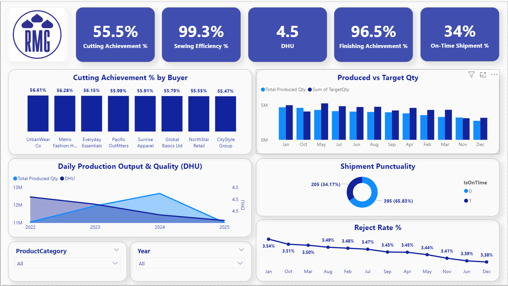
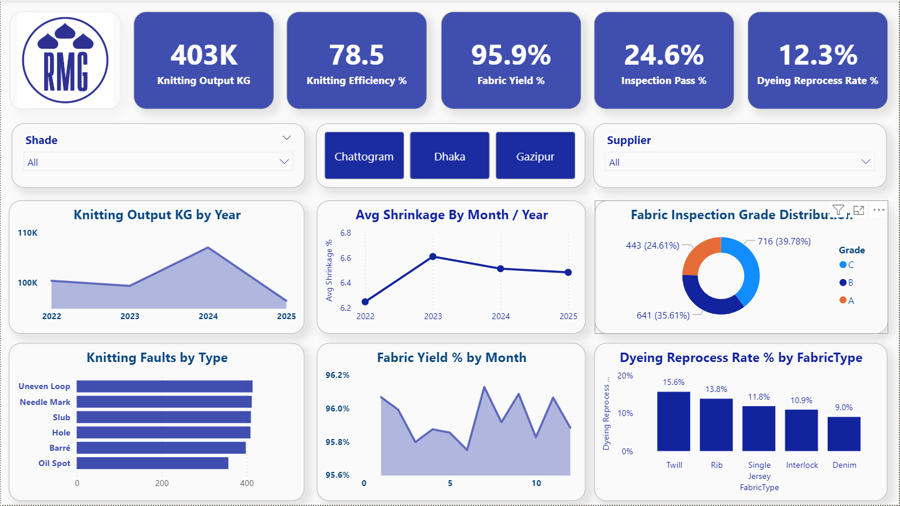

# 🧵 RMG Textile & Garments Manufacturing Analytics

An end-to-end **Power BI** analytics solution for a Ready-Made Garments (RMG) manufacturer, covering the full production pipeline — from **yarn and knitting**, through **dyeing and fabric finishing**, to **cutting, sewing, finishing, and shipment**. The model surfaces efficiency, quality, and on-time-delivery KPIs across every stage of the value chain, giving factory and merchandising teams a single source of truth for operational decision-making.

---

## 📊 Dashboards

The report is split into two focused dashboards, one for the garments manufacturing side and one for the textile (knitting/dyeing/fabric) side.

### 1. Garments Manufacturing Summary (GMS)
Tracks the garment production journey — cutting, sewing, finishing, and shipment.



**Highlights:** Cutting Achievement %, Sewing Efficiency %, DHU, Finishing Achievement %, On-Time Shipment %, Produced vs Target Qty, Shipment Punctuality, and Reject Rate % trends — all sliceable by Product Category and Year.

### 2. Textile Manufacturing Summary (TMS)
Tracks the upstream textile journey — knitting, fabric inspection, and dyeing.



**Highlights:** Knitting Output KG, Knitting Efficiency %, Fabric Yield %, Fabric Inspection Pass Rate %, Dyeing Reprocess Rate %, Shrinkage trends, and Knitting Fault breakdowns — filterable by Shade, Factory Location (Chattogram / Dhaka / Gazipur), and Supplier.

---

## 🧠 Key Business Insights

A full write-up of findings is available in [`🧵 Textile Operational Insights.pdf`](%F0%9F%A7%B5%20Textile%20Operational%20Insights.pdf). Summary below:

### Textile side (TMS)
| Area | Finding |
|---|---|
| Fabric Inspection | Only **24.6%** of rolls achieve Grade A; over **75%** of fabric input fails to meet standard spec (Grade B 35.6%, Grade C 39.8%) |
| Dyeing Reprocess | Overall reprocess rate is **12.3%**, more than 2x the 5.0% industry benchmark — Twill (15.6%) and Rib (13.8%) are the weakest fabric types |
| Knitting | Efficiency sits at **78.5%**, below the 80% target; "Uneven Loop" and "Needle Mark" faults each exceed 500 occurrences, pointing to worn needles/tension issues |
| Shrinkage | Average shrinkage has climbed from 6.2% (2022) to a 6.4–6.6% plateau, above the 5.0% acceptable ceiling |

### Garments side (GMS)
| Area | Finding |
|---|---|
| Cutting | **Primary bottleneck** — achievement is locked at 55.5% (range 55.47%–56.61%) across all 8 buyers, starving downstream sewing/finishing |
| Sewing | Efficiency is a strong **99.3%**, but DHU is **4.5** vs a target ceiling of 3.0 — speed is coming at the cost of quality |
| Finishing | 96.5% finishing achievement, but reject rate stays above the 3.0% threshold all year (3.54% → 3.38%) |
| Shipment | Only **34.17%** (205/600) of shipments are on time — driven largely by the cutting bottleneck, exposing the business to penalties and cancellations |

### 🚨 Priority focus areas
1. **On-Time Shipments (34.17%)** — elevate immediately to reduce commercial/contract risk
2. **Cutting Achievement (55.5%)** — the core physical bottleneck constraining the entire downstream floor
3. **Fabric Inspection Pass Rate (24.6%)** — fix upstream fabrication settings to stop substandard rolls entering production

### 🛠 Strategic recommendations
- Implement planned needle & tension audits on knitting machines to lift Grade A conversion
- Re-balance cutting room capacity so output matches sewing floor's 99.3% absorption rate
- Enforce inline quality controls on the sewing floor to bring DHU down to target without sacrificing throughput

---

## 🗂 Data Model

The model follows a **star schema**, built from 5 dimension tables and 9 fact tables covering the full production and commercial lifecycle.

**Dimensions**
- `dim_date` — calendar/time intelligence
- `dim_buyer` — buyer/customer master
- `dim_factory` — factory/unit master
- `dim_line` — production line master
- `dim_style` — style master (incl. SMV for efficiency calcs)

**Facts**
- `fact_order` — order quantities and value
- `fact_yarn_store` — yarn receipt (KG)
- `fact_knitting` — knitting output and efficiency
- `fact_dyeing` — dyeing throughput, grey/finish KG, reprocess flag
- `fact_fabric_finishing` — fabric shrinkage
- `fact_fabric_inspection` — fabric grading (A/B/C)
- `fact_cutting_daily` — daily cut quantity by order
- `fact_production_daily` — daily sewing output, available minutes, DHU
- `fact_finishing_daily` — packed, finished, and reject quantities
- `fact_shipment` — shipment on-time flag and days deviation

---

## 📁 Repository Structure

```
rmg-textile-analytics/
│
├── images/                          # Dashboard screenshots
│   ├── GMS.PNG                      # Garments Manufacturing Summary
│   └── TMS.PNG                      # Textile Manufacturing Summary
│
├── dim_buyer.xlsx                   # Buyer master
├── dim_date.xlsx                    # Date table
├── dim_factory.xlsx                 # Factory master
├── dim_line.xlsx                    # Production line master
├── dim_style.xlsx                   # Style master (incl. SMV)
│
├── fact_cutting_daily.xlsx          # Daily cutting records
├── fact_dyeing.xlsx                 # Dyeing batch records
├── fact_fabric_finishing.xlsx       # Fabric shrinkage records
├── fact_fabric_inspection.xlsx      # Fabric grading records
├── fact_finishing_daily.xlsx        # Daily finishing/packing records
├── fact_knitting.xlsx               # Knitting production records
├── fact_order.xlsx                  # Order master
├── fact_production_daily.xlsx       # Daily sewing/production records
├── fact_shipment.xlsx               # Shipment records
├── fact_yarn_store.xlsx             # Yarn receipt records
│
├── Dashboard.pbix
├── Textile_Operational_Insights.pdf # Written insights & recommendations
└── README.md                        # You are here
```

---

## 🧰 Tools & Techniques

- **Power BI Desktop** — data modeling, DAX, and report design
- **Star schema modeling** — 5 dimension tables + 9 fact tables joined on surrogate keys
- **DAX** — 20+ custom measures for achievement %, efficiency, quality, and yield KPIs
- **Time intelligence** — `dim_date` drives Year/Month drill-downs and dynamic titles
- **Interactive filtering** — buttons, slicers, and cross-filtering across visuals (Shade, Factory, Supplier, Product Category, Year)

---

## 📌 Notes

- All figures shown in the dashboards are based on sample/anonymized production data intended to demonstrate the analytics approach.
- Targets/benchmarks referenced in the insights (e.g., DHU ≤ 3.0, shrinkage ≤ 5.0%, dyeing reprocess ≤ 5.0%) reflect general RMG industry standards used for gap analysis.
